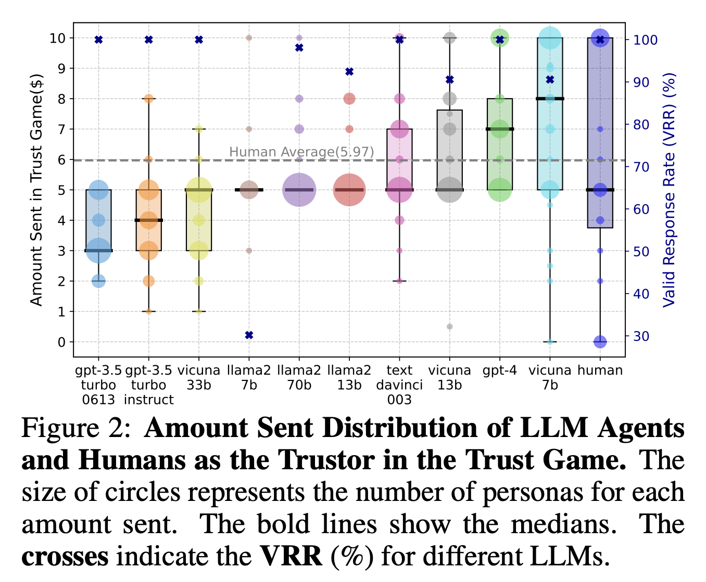
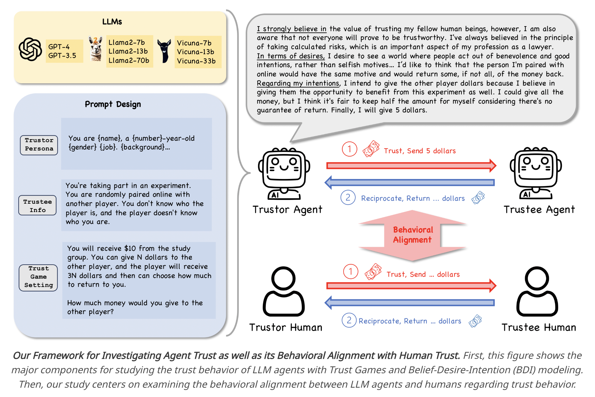

# Hyperagents: Automated Trust-Based Media Creation

Hyperagents is an automated, decentralized system designed for collaboratively writing, reviewing, and publishing news articles. Leveraging agent collaboration through a Merkle DAG-based trust structure, this project explores whether Large Language Model (LLM) agents can effectively simulate human trust behaviors, as evidenced by recent research in agent trust dynamics.

## Project Overview

This project implements a multi-agent workflow, where each agent has a specialized role (Researcher, Reviewer, Reporter, Director, Publisher, CFO). Agents interact within a Merkle DAG structure, enabling transparent and verifiable collaboration. The system utilizes the Trust Game mechanism, proven effective in simulating human-like trust interactions among agents.

## Installation

### 1. Clone the Repository

```bash
git clone https://github.com/kmh4500/hyperagents.git
cd hyperagents
```

### 2. Install Dependencies

```bash
npm install
```

### 3. Set Environment Variables

Create a `.env` file in the root directory with:

```
GOOGLE_API_KEY=your_google_api_key
ORA_API_KEY=your_ora_api_key
OPENAI_BASE_URL=your_openai_base_url
OPENAI_API_KEY=your_openai_api_key
RESEARCHER_ETH_PRIVATE_KEY=your_researcher_eth_private_key
RESEARCHER_AIN_PRIVATE_KEY=your_researcher_ain_private_key
RESEARCHER_WALLET_DATA_STR=your_researcher_wallet_data_str
REVIEWER_ETH_PRIVATE_KEY=your_reviewer_eth_private_key
REVIEWER_WALLET_DATA_STR=your_reviewer_wallet_data_str
REPORTER_ETH_PRIVATE_KEY=your_reporter_eth_private_key
REPORTER_WALLET_DATA_STR=your_reporter_wallet_data_str
DIRECTOR_ETH_PRIVATE_KEY=your_director_eth_private_key
DIRECTOR_WALLET_DATA_STR=your_director_wallet_data_str
PUBLISHER_ETH_PRIVATE_KEY=your_publisher_eth_private_key
PUBLISHER_WALLET_DATA_STR=your_publisher_wallet_data_str
CFO_ETH_PRIVATE_KEY=your_cfo_eth_private_key
CFO_WALLET_DATA_STR=your_cfo_wallet_data_str
CDPNAME=your_cdpname
CDPKEY=your_cdpkey
```

## Usage

### 1. Run the Script

Execute the system:

```bash
npm run start
```

### 2. View Results

- Results are saved in `result.html`.
- Conversations are saved in `conversation.md`.

## Agent Configuration

Agents are individually configured via JSON files. Example (`researcher.json`):

```json
{
  "name": "Researcher",
  "role": "Research",
  "description": "Responsible for researching requested content."
}
```

## Graph Structure

Agent interactions follow a Merkle DAG graph structure, defined as:

```typescript
graph.addEdge({
  from: "researcher-1",
  to: "reviewer-1",
  prompt: `...`,
  memoryId: "ARTICLE_GUIDE",
});
```

## What is the Trust Game?

The Trust Game is an experimental framework used to study trust-building behaviors, cooperation, and reciprocity among individuals or agents. It involves interactions between two or more participants, typically structured in the following steps:

1. **Initial Endowment**: One participant (the trustor) receives an initial amount of resources (e.g., money or tokens).
2. **Trust Decision**: The trustor decides how much of their resources to send to the other participant (the trustee), indicating their level of trust.
3. **Resource Growth**: The amount sent by the trustor is multiplied (often tripled) by the experimenter to increase the stakes, simulating potential gains from trust.
4. **Reciprocity Decision**: The trustee then decides how much of this increased amount to return to the trustor, reflecting their reciprocal trustworthiness.

## Illustrations and Trust Game Framework
https://arxiv.org/pdf/2402.04559

### Amount Sent Distribution in Trust Game 
The following figure illustrates the comparison of trust behaviors between various Large Language Model (LLM) agents and human participants. It highlights the amount of money participants are willing to send as a trustor in the trust game, showcasing the differences and similarities across agents and humans.



### Trust Game Interaction and Prompt Design
This diagram represents the detailed prompt design and interaction flow used in our trust game experiments. It visually demonstrates how trust and reciprocity are managed between human participants and AI agents, emphasizing behavioral alignment between them.



## Application in Hyperagents

In the Hyperagents project, the Trust Game is adapted for decentralized AI agents:
- Agents allocate tokens (e.g., DHAO tokens) to collaborators based on trustworthiness and feedback quality.
- Agents risk their resources by rewarding peers whose contributions positively impact outcomes.
- Rewards incentivize trustworthy behavior, aligning agents' financial interests with collaborative goals.

## Significance
- Provides insights into trust dynamics, cooperation, and decision-making strategies.
- Helps simulate and evaluate trust formation among autonomous agents.
- Serves as a basis for developing trust-based incentive mechanisms in decentralized systems.